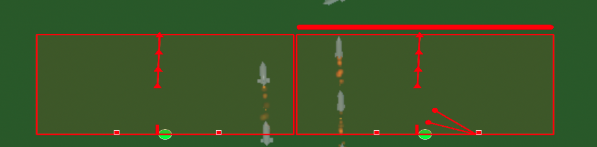
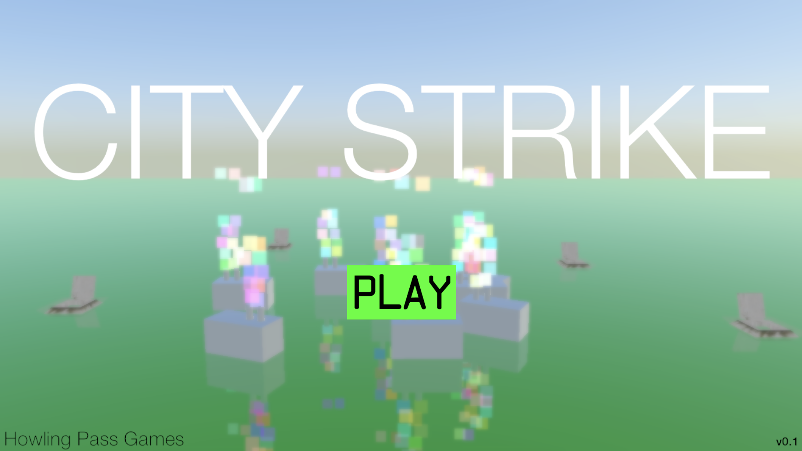
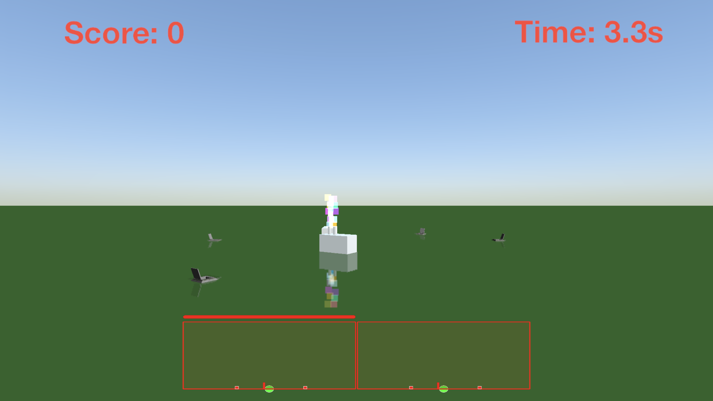
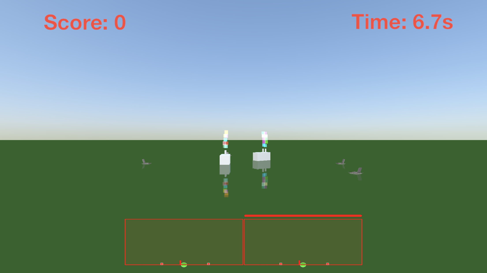
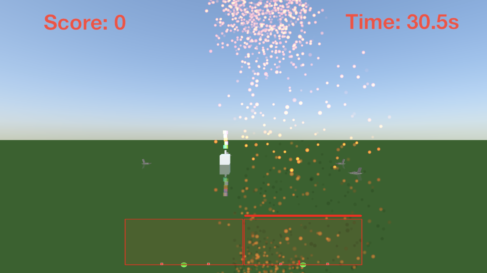
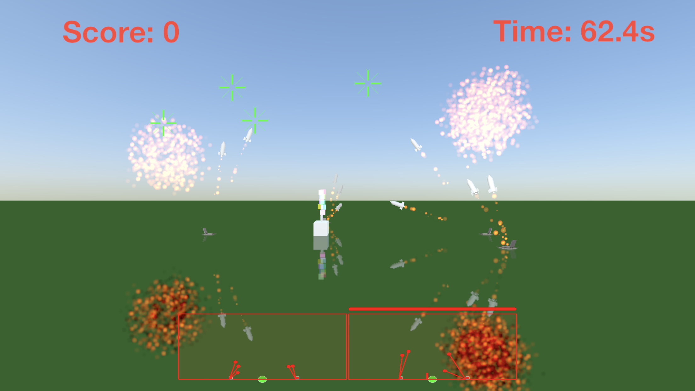
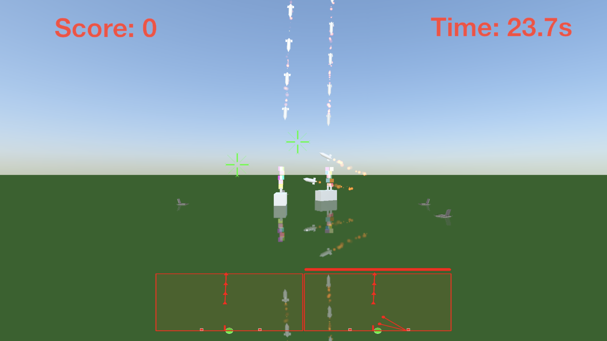
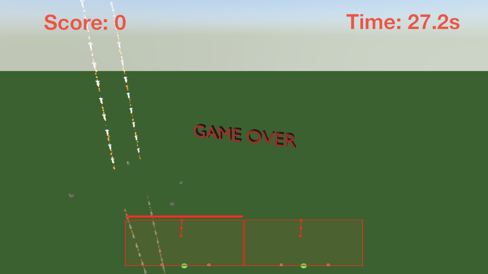

# 3DMissileCommand (Prototype)
3D Remake of Missile Command Game for iOS. It was made using Apple's SceneKit Library.

This prototype explores a 3D version of [Missile Command](https://en.wikipedia.org/wiki/Missile_Command)
which is organised into two separate planes. Enemy missiles are launched along
each plane at buildings on the same plane. The player must switch between each plane with the
mini-maps along the bottom to fire missiles to destroy the incoming missiles.

## Plane Mini-maps
Along the bottom of the screen are the plane mini-map. The player switches between the planes by
pressing either mini-map.

## Screenshots

### Title Screen

### Play Screen

### End Game
When all the buildings are destroyed the game is over.

